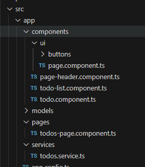
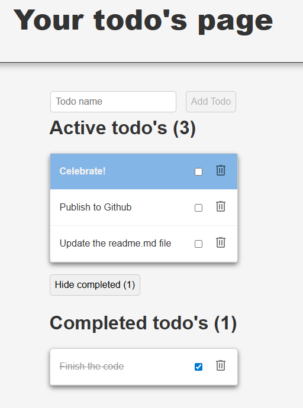

# Controller based .NET Core Web API with Angular 20 frontend.

First of all, let's make sure we have the latest Angular CLI.
```bash
npm uninstall -g @angular/cli
npm install -g @angular/cli@latest
```

We are implementing the following tutorial for the backend.
https://learn.microsoft.com/en-us/aspnet/core/tutorials/first-web-api?view=aspnetcore-8.0&tabs=visual-studio-code

## Create the backend-project
We are creating a controller based web-API project called TodoApi that is using an in memory database.

```bash
dotnet new webapi --use-controllers -o TodoApi
cd TodoApi
dotnet add package Microsoft.EntityFrameworkCore.InMemory
code -r ../TodoApi
```

Now that the project is created, let's make sure we trust the development certificates.
```bash
dotnet dev-certs https --trust
```
Add a .gitignore file to the root folder. If you need to do this afterwards and you want to exclude folders that have already been checked in, you need to remove them from the git cache before they are ignored. This example excludes the wwwroot folder from the git-cache.

```bash
git rm --cached wwwroot -r
```
You can start the backend project with the following command.
```bash
dotnet run --launch-profile https
```

It has a Weatherforecasts endponit per default. You can view your current API using the swagger:
https://localhost:7190/swagger/index.html

## Create the model and datacontext.
Create a folder named Models and add two classes.

```csharp
namespace TodoApi.Models;

public class TodoItem
{
    public long Id { get; set; }
    public string? Name { get; set; }
    public bool IsComplete { get; set; }
}


//Models/TodoContext.cs
using Microsoft.EntityFrameworkCore;

namespace TodoApi.Models;

public class TodoContext : DbContext
{
    public TodoContext(DbContextOptions<TodoContext> options)
        : base(options)
    {
    }

    public DbSet<TodoItem> TodoItems { get; set; } = null!;
}
```

To use the datacontext, we need to register it using dependency injection. Open the Program.cs file and add the DbContext.
```csharp
var builder = WebApplication.CreateBuilder(args);

// Add services to the container.

builder.Services.AddControllers();

//Registrera DbContext med in-memory database
builder.Services.AddDbContext<TodoContext>(options =>
    options.UseInMemoryDatabase("ToDoList"));
// Learn more about configuring Swagger/OpenAPI at https://aka.ms/aspnetcore/swashbuckle
builder.Services.AddEndpointsApiExplorer();
builder.Services.AddSwaggerGen();

var app = builder.Build();
```

## Deploy backend-API and the Angular frontend as a single webapplication
To make sure the backend and frontend run as one application, we need to enable Static content and register the main page of the Angular application (index.html) as a fallback page, when the dotnet application doesn't have a matching route.
Continue to edit the Program.cs file by adding the following for when we're not in Development mode.

```csharp
var app = builder.Build();

// Configure the HTTP request pipeline.
if (app.Environment.IsDevelopment())
{
    app.UseSwagger();
    app.UseSwaggerUI();
}

if (!app.Environment.IsDevelopment())
{
    app.UseStaticFiles();
    app.MapFallbackToFile("index.html"); // låt Angular ta över routing i prod
}
```
We will update the build output for the Angular application later on, to the wwwroot folder of the dotnet core application.

## Use scaffolding to generate a controller for our TodoItem model.
Our next step is to install the scaffolding engine. Makre sure you're in the todoApi folder and run the following commands. This will install the latest version of the code generator and unistall any previous version.

```bash
dotnet add package Microsoft.VisualStudio.Web.CodeGeneration.Design
dotnet add package Microsoft.EntityFrameworkCore.Design
dotnet add package Microsoft.EntityFrameworkCore.SqlServer
dotnet add package Microsoft.EntityFrameworkCore.Tools
dotnet tool uninstall -g dotnet-aspnet-codegenerator
dotnet tool install -g dotnet-aspnet-codegenerator
dotnet tool update -g dotnet-aspnet-codegenerator
```

We are now able to generate our controller, based on the previously created model and datacontext.
```bash
dotnet aspnet-codegenerator controller -name TodoItemsController -async -api -m TodoItem -dc TodoContext -outDir Controllers
```
## Using DTO models to prevent properties to be exposed by the API
To examplify the use of Data-Transfer-Objects (DTO), we will now add an additional property to the TodoItem model. Let's call it secret. We will also create a new class TodoItemDTO, that does not contain the property from our database, that we don't want to expose using the API.

```csharp
//Models/TodoItem.cs
namespace TodoApi.Models
{
    public class TodoItem
    {
        public long Id { get; set; }
        public string? Name { get; set; }
        public bool IsComplete { get; set; }
        public string? Secret { get; set; }
    }
}

//Models/TodoItemDTO.cs
namespace TodoApi.Models;

public class TodoItemDTO
{
    public long Id { get; set; }
    public string? Name { get; set; }
    public bool IsComplete { get; set; }
}
```

We update the Controller with a private method ItemToDTO, that copies our database model object, to a DTO object with only the visible properties. We use this method before we return data, and also update the controller methods to use the TodoItemDTO class as the model type.
```csharp
using System;
using System.Collections.Generic;
using System.Linq;
using System.Threading.Tasks;
using Microsoft.AspNetCore.Http;
using Microsoft.AspNetCore.Mvc;
using Microsoft.EntityFrameworkCore;
using ToDoApi.Models;
using TodoApi.Models;

namespace TodoApi.Controllers
{
    [Route("api/[controller]")]
    [ApiController]
    public class TodoItemsController : ControllerBase
    {
        private readonly TodoContext _context;

        public TodoItemsController(TodoContext context)
        {
            _context = context;
        }

        // GET: api/TodoItems
        [HttpGet]
        public async Task<ActionResult<IEnumerable<TodoItemDTO>>> GetToDoItems()
        {
            return await _context.ToDoItems.Select(i => ItemToDTO(i)).ToListAsync();
        }

        // GET: api/TodoItems/5
        [HttpGet("{id}")]
        public async Task<ActionResult<TodoItemDTO>> GetTodoItem(long id)
        {
            var todoItem = await _context.ToDoItems.FindAsync(id);

            if (todoItem == null)
            {
                return NotFound();
            }

            return ItemToDTO(todoItem);
        }

        // PUT: api/TodoItems/5
        // To protect from overposting attacks, see https://go.microsoft.com/fwlink/?linkid=2123754
        [HttpPut("{id}")]
        public async Task<IActionResult> PutTodoItem(long id, TodoItemDTO todoDTO)
        {
            if (id != todoDTO.Id)
            {
                return BadRequest();
            }

            var todoItem = await _context.ToDoItems.FindAsync(id);
            if (todoItem == null)
            {
                return NotFound();
            }
            todoItem.Name = todoDTO.Name;
            todoItem.IsComplete = todoDTO.IsComplete;

            _context.Entry(todoItem).State = EntityState.Modified;

            try
            {
                await _context.SaveChangesAsync();
            }
            catch (DbUpdateConcurrencyException)
            {
                if (!TodoItemExists(id))
                {
                    return NotFound();
                }
                else
                {
                    throw;
                }
            }

            return NoContent();
        }

        // POST: api/TodoItems
        // To protect from overposting attacks, see https://go.microsoft.com/fwlink/?linkid=2123754
        [HttpPost]
        public async Task<ActionResult<TodoItemDTO>> PostTodoItem(TodoItemDTO todoItemDTO)
        {
            var todoItem = new TodoItem
            {
                IsComplete = todoItemDTO.IsComplete,
                Name = todoItemDTO.Name
            };

            _context.ToDoItems.Add(todoItem);
            await _context.SaveChangesAsync();

            return CreatedAtAction(nameof(GetTodoItem),new { id = todoItem.Id }, ItemToDTO(todoItem));
        }

        // DELETE: api/TodoItems/5
        [HttpDelete("{id}")]
        public async Task<IActionResult> DeleteTodoItem(long id)
        {
            var todoItem = await _context.ToDoItems.FindAsync(id);
            if (todoItem == null)
            {
                return NotFound();
            }

            _context.ToDoItems.Remove(todoItem);
            await _context.SaveChangesAsync();

            return NoContent();
        }

        private static TodoItemDTO ItemToDTO(TodoItem todoItem) =>
            new TodoItemDTO
            {
                Id = todoItem.Id,
                Name = todoItem.Name,
                IsComplete = todoItem.IsComplete
            };
        
        private bool TodoItemExists(long id)
        {
            return _context.ToDoItems.Any(e => e.Id == id);
        }
    }
}

```

## Create the Angular frontend application
Ok. Let's create the Angular frontent. We do this from the TodoApi folder. I'm calling it clientApp and it will be generated as a subfolder of the main application.
```bash
ng new clientApp --routing --standalone --skip-git --skip-tests
```

Now that the angular app is created, we want to add a proxy file that tells the Angular application to redirect any call starting with /api to the backend application. Make sure to update the port if your app is running at another port than mine.
name the file **proxy.conf.json** and place it in the **clientApp/src** folder.
```json
{
  "/api": {
    "target": "https://localhost:7190",
    "secure": false,
    "changeOrigin": true
  }
}
```

To use the proxy file we create an npm command called start.
open the **clientApp/package.json** file and add the following command.

```json
"scripts": {
    "ng": "ng",
    "start": "ng serve --open --proxy-config src/proxy.conf.json",
```

We also want to change the build output, so that the generated files of the Angular application is placed in the **wwwroot** folder of the **todoApi** application.
Do this by editing the **angular.json** file. Set the **architect.build.optins.outputPath** to "../wwwroot".

```json
"architect": {
        "build": {
          "builder": "@angular/build:application",
          "options": {
            "browser": "src/main.ts",
            "polyfills": [
              "zone.js"
            ],
            "outputPath": "../wwwroot",
```

## Genereate typescript models based on the API
We don't want to rewrite all models exposed by the API as typescript models manually. We can use **swagger** to generate the models for us. In this example, I'm only generating the data contracts, not the Api proxy. This is because I use Angular for the front end. I want to be able to add injectors to the webClient later.
Let's add another npm command to **clientApp/package.json**. The reason I'm using curl to save the swagger.json to disk, is that we avoid problems with self signed certificates that way.
```json
"scripts": {
    "ng": "ng",
    "start": "ng serve --open --proxy-config src/proxy.conf.json",
    "swagger-types": "curl -k https://localhost:7190/swagger/v1/swagger.json -o ./swagger.json && npx swagger-typescript-api generate -p ./swagger.json -o src/app/models --modular --templates typescript --no-client",
```
Run the code generation with the following command.
```bash
npm run swagger-types
```
The first time you run this command you will be asked to install a package **swagger-typescript-api@[version]**. Just answer y to install.

This will generate the file **clientApp/src/app/models/data-contracts.ts** with the generated data contracts. Also notis that you'll have a **swagger.json** file in your clientApp directory.

```typescript
/* eslint-disable */
/* tslint:disable */
// @ts-nocheck
/*
 * ---------------------------------------------------------------
 * ## THIS FILE WAS GENERATED VIA SWAGGER-TYPESCRIPT-API        ##
 * ##                                                           ##
 * ## AUTHOR: acacode                                           ##
 * ## SOURCE: https://github.com/acacode/swagger-typescript-api ##
 * ---------------------------------------------------------------
 */

export interface TodoItemDTO {
  /** @format int64 */
  id?: number;
  name?: string | null;
  isComplete?: boolean;
}

export interface WeatherForecast {
  /** @format date */
  date?: string;
  /** @format int32 */
  temperatureC?: number;
  /** @format int32 */
  temperatureF?: number;
  summary?: string | null;
}
```

## Setting up some Angular CLI code generation standards
Let's make some adjustments to **angular.json** for this example. This is optional. I want a single file to be generated, with inline style and templates. I also like the generated files to have suffixes for the different types.
```json
"schematics": {
        "@schematics/angular:component": {
          "style": "scss",
          "skipTests": true,
          "inlineStyle": true,
          "inlineTemplate": true,
          "flat": true,
          "type": "component"
        },
        "@schematics/angular:class": {
          "skipTests": true
        },
        "@schematics/angular:directive": {
          "skipTests": true,
          "flat": true,
          "type": "directive"
        },
        "@schematics/angular:guard": {
          "skipTests": true
        },
        "@schematics/angular:interceptor": {
          "skipTests": true
        },
        "@schematics/angular:pipe": {
          "skipTests": true
        },
        "@schematics/angular:resolver": {
          "skipTests": true
        },
        "@schematics/angular:service": {
          "skipTests": true,
          "flat": true,
          "type": "service"
        }
      },
```
Let's generate 3 components to handle our todo's.
```bash
ng g c components/ui/page 
ng g c pages/TodosPage
ng g c components/PageHeader
ng g c components/TodoList
ng g c components/Todo
nh g s services/Todos
```
Here you can see the folder structure and naming conventions.



## The todos.service.ts
Angular has a concept of signal based services. This is a great way to centralize logic and to share state between components.
We will implement a service that uses our API and the generated typescript models.
The **todo** and **todos** signals are resource based and whenever they are reloaded the components that use them will be notified. This is done automatically when a signal used by the resource has an updated value, or manually, when the reload() method is called on the signal. We do this when we've mutaded our data, by calling one of the save or delete methods.

```typescript
import { computed, Injectable, resource, signal } from '@angular/core';
import { TodoItemDTO } from '../models/data-contracts';

@Injectable({
  providedIn: 'root'
})
export class TodosService {
  
  selectedTodoId = signal<number | undefined>(undefined);

  todos = resource<TodoItemDTO[], string>({
    params: () => '',
    loader: async () => {
      console.log('Loading todos from API...');
      const response = await fetch('/api/TodoItems');
      if (!response.ok) {
        throw new Error('Failed to fetch todos');
      }
      const json = await response.json();
      console.log('Fetched todos:', json);
      return json;
    }
  });
  
  todo = resource<TodoItemDTO | undefined, number | undefined>({
    params: () => this.selectedTodoId(),
    loader: async ({params: id, abortSignal}) => {
      if (id === undefined) {
        return undefined;
      }
      const response = await fetch(`/api/TodoItems/${id}`);
      if (!response.ok) {
        throw new Error('Failed to fetch todo');
      }
      const json = await response.json();
      console.log('Fetched todo:', json);
      return json;
    }
  });

  async createTodo(todo:TodoItemDTO): Promise<TodoItemDTO> {
    const response = await fetch('/api/TodoItems', {
      method: 'POST',
      headers: {
        'Content-Type': 'application/json'
      },
      body: JSON.stringify(todo)
    });
    if (!response.ok) {
      throw new Error('Failed to create new todo');
    }
    const json:TodoItemDTO = await response.json();
    
    this.selectedTodoId.set(json.id);
    console.log('Saved new todo:', json);
    this.todos.reload();
    this.todo.reload();
    return json;
  }

  async updateTodo(todo:TodoItemDTO): Promise<void> {
    console.log('Saving todo:', todo);
    const response = await fetch(`/api/TodoItems/${todo.id}`, {
      method: 'PUT',
      headers: {
        'Content-Type': 'application/json'
      },
      body: JSON.stringify(todo)
    });
    if (!response.ok) {
      throw new Error('Failed to save todo');
    }       
    this.todos.reload();
    this.todo.reload();
    
  }

  async deleteTodo(id:number): Promise<void> {
    const response = await fetch(`/api/TodoItems/${id}`, {
      method: 'DELETE'
    });
    if (!response.ok) {
      throw new Error('Failed to delete todo');
    }
    console.log('Deleted todo:', id);
    this.selectedTodoId.set(undefined);
    this.todos.reload();
    this.todo.reload();
  }
}


```

## Setup a route and create our page
We're now gonna build the UI. It will look something like this:


The entry point of the application is index.html. It calls the `<app-root></app-root>` component in the body of the html page. This is implemented in the app.ts component.
I'm going to create a wrapper component called page. This can be handy if you don't want the same overall structure for all pages. If you want a global structure, you can just place the logic of the Page component i the app component istead.
But lets update the app.ts component to be inline. This let's us delete the app.html and app.scss files. 

```typescript
import { Component, signal } from '@angular/core';
import { RouterOutlet } from '@angular/router';

@Component({
  selector: 'app-root',
  imports: [RouterOutlet],
  template: `<router-outlet />`,
  styles: ``
})
export class App {
  protected readonly title = signal('clientApp');
}
```
The only thing the app component does it to output the component instantiated by the current route using `<router-outlet />`.

Next, We want to create a route for the base of our application, that will open our todos-page.component. Edit the **app.routes.ts** file to the following.
```typescript
import { Routes } from '@angular/router';
import { TodosPageComponent } from './pages/todos-page.component';

export const routes: Routes = [
    {
        path: '',
        pathMatch: 'full',
        component: TodosPageComponent
    }
];
```

The wrapper component **page.component.ts** looks like this. It enables us to always output a header and set some styling.
```typescript
import { Component, input } from '@angular/core';
import { PageHeaderComponent } from "../page-header.component";

@Component({
  selector: 'app-page',
  imports: [PageHeaderComponent],
  template: `
    <div class="page">
      <app-page-header [title]="title()"/>
      <ng-content></ng-content>      
    </div>
  `,
  styles: ``
})
export class PageComponent {
  title = input.required<string>();
}
```

Our actuall page, uses the <app-page> component and looks like this.
```typescript
import { Component, computed, inject, input, signal } from '@angular/core';
import { PageHeaderComponent } from '../components/page-header.component';
import { PageComponent } from "../components/ui/page.component";
import { TodosService } from '../services/todos.service';
import { TodoListComponent } from '../components/todo-list.component';

@Component({
  selector: 'app-todos-page',
  imports: [PageComponent, TodoListComponent],
  template: `
    <app-page title="Your todo's page">
      <div>
      <app-todo-list 
        [showCreateForm]="true" 
        [todoItems]="activeTodos()" 
        listTitle="Active todo's" />

      <div style="margin: 20px 0;">
        <button 
          (click)="showCompletedList.set(!showCompletedList())">
            {{showCompletedList() ? 'Hide completed' : 'Show completed'}} 
            ({{completedTodos().length}})
        </button>
      </div>

      @if(showCompletedList()){
        <app-todo-list 
          [todoItems]="completedTodos()" 
          listTitle="Completed todo's" />
      }
      </div>
    </app-page>
  `,
  styles: ``
})
export class TodosPageComponent {
  todosService = inject(TodosService);
  showCompletedList = signal<boolean>(false);

  activeTodos = computed(() => {
    return (this.todosService.todos.value() ?? []).filter(t => !t.isComplete);
  });
  
  completedTodos = computed(() => {
    return (this.todosService.todos.value() ?? []).filter(t => t.isComplete) ?? [];
  });
}
```

Here we have a new type of signal, **computed**. You can think of these as your view models. These are simply filtered versions of all todo items and will be re-computed whenever the service signal **todos** is updated.

## The todo components

The `<app-todo-list>` component lists the todos exposed by the service and if enabled by the showCreateForm signal, allows the user to create new todos.
This is done by calling the **createTodo** method of the service. It also sorts the todos for nicer display.

```typescript
import { Component, computed, inject, input } from '@angular/core';
import { TodosService } from '../services/todos.service';
import { FormBuilder, ReactiveFormsModule, Validators } from '@angular/forms';
import { CommonModule } from '@angular/common';
import { TodoItemDTO } from '../models/data-contracts';
import { TodoComponent, TodoForm } from './todo.component';

@Component({
  selector: 'app-todo-list',
  imports: [ReactiveFormsModule, CommonModule, TodoComponent],
  template: `
    
    <form [formGroup]="form" (ngSubmit)="AddNewTodo()">
      @if(showCreateForm()){
      <div class="form-row">
        <input formControlName="name" placeholder="Todo name" />
        <button type="submit" [disabled]="form.invalid">Add Todo</button>
      </div>
      }
      <h2>{{title()}}</h2>      
      @if(this.todos().length === 0){
        <div>Nothing to do at the moment...</div>
      } 
      @else 
      {
        <ul class="todo-list">
        @for(todo of todos(); track todo.id){
          <app-todo [todo]="todo" />
        }
      </ul>  
      }
          
    </form>
  `,
  styles: ``
})
export class TodoListComponent {
  todoService = inject(TodosService);
  fb = inject(FormBuilder);

  todoItems = input.required<TodoItemDTO[]>();
  listTitle = input.required<string>();
  showCreateForm = input<boolean>(false);

  form:TodoForm = this.fb.group({
    id: [0],
    name: ['', [Validators.required]],
    isComplete: [false]
  });

  title = computed<string>(() => {
    if(this.todoItems().length === 0){
      return this.listTitle();
    }
    return `${this.listTitle()} (${this.todoItems().length})`;
  });

  todos = computed(() => {
    const list = this.todoItems() ?? [];
    /* Sort the list so that the active todo comes first, 
       then incompleted todos followed by completed todos, 
       both sorted by id descending */
    return list.sort((a, b) => 
      a.id === this.todoService.selectedTodoId() && b.id !== this.todoService.selectedTodoId() ? -1 
      : a.id !== this.todoService.selectedTodoId() && b.id === this.todoService.selectedTodoId() ? 1 
      : a.isComplete && !b.isComplete ? 1
      : !a.isComplete && b.isComplete ? -1      
      : 0
      || 
      (b.id ?? 0) - (a.id ??
      0
    )
  );
  });

  async AddNewTodo() {
    if (this.form.valid) {
      const todo = await this.todoService.createTodo(this.form.value as TodoItemDTO);
      this.form.controls.id.setValue(0);
      this.form.controls.name.setValue('');
      this.form.controls.isComplete.setValue(false);
      console.log('Har nollställt formuläret', this.form.value);
    }
  }
}
```

The `<app-todo>` component shows a single todo. When the user checks the completed checkbox, the todo is updated using the service. If the trash can is clicked, the todo is deleted.
Since we're using the service from all components, the UI is automatically updated whenever we mutate the todo's.
This component use the ngClass attribute to set conditional styling for the component. It is used to set css classes based on conditions.

```typescript
import { Component, computed, inject, input, OnInit } from '@angular/core';
import { TodoItemDTO } from '../models/data-contracts';
import { FormBuilder, FormControl, FormGroup, ReactiveFormsModule } from '@angular/forms';
import { TodosService } from '../services/todos.service';
import { CommonModule } from '@angular/common';
import { DeleteButtonComponent } from './ui/buttons/delete-button.component';

export type TodoForm = FormGroup<{
  id: FormControl<number | null>;
  name: FormControl<string | null>;
  isComplete: FormControl<boolean | null>;
}>;
@Component({
  selector: 'app-todo',
  imports: [ReactiveFormsModule, CommonModule, DeleteButtonComponent],
  template: `
    <li [ngClass]="{'todo': true,
      'todo-active': isNewestTodo() && !todo().isComplete,
      'todo-completed': todo().isComplete}">
      <div>{{ todo().name }}</div>  
      <input type="checkbox" 
        [formControl]="this.formGroup.controls.isComplete" 
        (change)="saveTodo();"/>
      <app-delete-button (onDelete)="deleteTodo()"></app-delete-button>
    </li>
  `,
  styles: ``
})
export class TodoComponent implements OnInit {
  
  todoService = inject(TodosService);
  fb = inject(FormBuilder);

  todo = input.required<TodoItemDTO>();

  isNewestTodo = computed(() => {
    return this.todo().id === (this.todoService.todo.value()?.id ?? -1);
  });
  formGroup:TodoForm = this.fb.group({
    id: [0],
    name: [''],
    isComplete: [false]
  });

  ngOnInit(): void {
    this.formGroup.controls.id.setValue(this.todo().id ?? null);
    this.formGroup.controls.name.setValue(this.todo().name ?? null);
    this.formGroup.controls.isComplete.setValue(this.todo().isComplete ?? false);
  }

  async saveTodo() {
    console.log('Spara todo', this.formGroup.value);
    await this.todoService.updateTodo(this.formGroup.value as TodoItemDTO);
  } 
  async deleteTodo() {
    if(this.todo().id){
      await this.todoService.deleteTodo(this.todo().id as number);
    }    
  }
}
```

All css classes can be found in the **styles.scss** file.